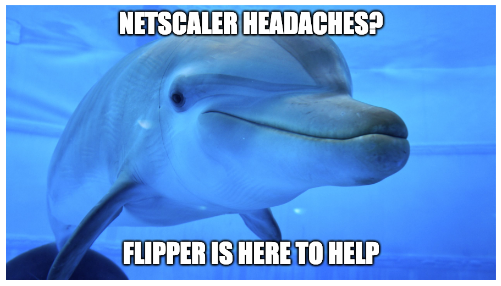

# project-flipper

Exploring Citrix/NetScaler configs

This project aims to explore the process of breaking down, analyzing and abstracting applications from a Citrix NetScaler config/archive (.conf/.tgz)

Future goals include conversion outputs for different supported F5 solutions, including BIG-IP TMOS, NGINX and F5 Distributed Cloud (XC)

# How to get started

1. Download the extension from the releases
2. Install the extension to VSCode
3. Open a folder with a Citrix ADC/NS archive or .conf
4. Open a Citrix ADC/NS .conf file
5. Right click in editor of the file
6. Select 'Explore ADC/NS (.conf/tgz)'
7. This should bring you to the new view from project-flipper with the config breakdown
  - Select an application to view it's config
  - Hover over the top menu item to see breakdown stats

# Breakdown Process

## 1. Archive unpack

> if file is .conf, skip to next step...

- stream archive (.tgz)
  - capture all .conf files
  - certs?
  - logs?

## 2. Breakdown config

- abstract each line to object type?

  config name | js object name? | documentation
  | :--- | :---: | ---:
  add lb vserver | addLbVserver | https://developer-docs.citrix.com/projects/netscaler-command-reference/en/12.0/lb/lb-vserver/lb-vserver/
  set ssl vserver | setSslVserver | 
  add lb monitor | addLbMonitor | 
  add ssl certKey | addSslCertkey | 
  bind lb vserver | bingLbVserver | 
  add server | addServer | 
  add ns ip | addNsIp | 

### Parse - verb sensetive

This first pass will break down config into parent objects based on <verb> (<type>|<type> <subType>)

## 3. Abstract applications

### walk vservers

This second phase will loop through each 'add vs vserver' and 'add lb vserver' to walk the config tree and abstract each application's config

1. start with each 'add lb vserver'
2. add ssl options with 'set ssl vserver'
3. add pool binding with 'bind lb vserver'
4. add pool details with 'add serviceGroup'
5. add pool bingdings with 'bind serviceGroup'
6. add monitor from service pool binginds 'add lb monitor'
...

# Notes

- All of the 'add' operations need to happen before the 'bind' operations
- order config lines by the following to make sure things are parsed in order
  - add -> set -> bind -> link -> enable -> disable
- .conf are the main config files, like tmos
  - each line is a single config (unlike tmos)
- archive files has an .tgz extension
  - Full and basic backups
- .log for log files
  - location?
- certs?
  - location?
- config lines with ip addresses in them (unique to customer env)
  - add ns ip
  - bind vlan ...
  - add snmp trap generic ...
  - add server <name> <ip>
  - add lb vserver <name> <type> <ip>
  - add cs vserver <name> <type> <ip>
  - add gslb site <name> <ip>
  - set ns rcpNode <ip>
  - seems that **'add lb vserver'** and **'add cs vserver'** are the two to indicate the front door for an app

# Resources

## NGINX

https://docs.nginx.com/nginx/deployment-guides/migrate-hardware-adc/citrix-adc-configuration/

## John Alam

https://community.f5.com/t5/codeshare/citrix-netscaler-to-f5-big-ip/ta-p/277635

## Carl Stalhood

https://github.com/cstalhood/Get-ADCVServerConfig 

https://www.carlstalhood.com/netscaler-scripting/ 

## Citrix ADC

### Citrix ADC Firmware Release Cycle

https://support.citrix.com/article/CTX241500/citrix-adc-firmware-release-cycle

Citrix has announced following updates to the Citrix ADC firmware release cycle.

- Citrix ADC Firmware Release Cycle (5 year) will fall on all versions starting with 13.0 and all subsequent releases.
  - Year 1 and Year 2 will include feature releases every quarter
  - Year 3 and Year 4 will include maintenance releases every 2-6 months until End of Maintenance (EOM) date. The updates will be more frequent during the initial maintenance years
  - Year 5 will include technical support only until End of Life (EOL) date for the firmware version
- Version 13.0 which initially had 3 year Release Cycle will now have the 5 year release cycle as described above.
- All Citrix ADC Firmware Releases will have a release cadence of once every two years.
  - Since 13.0 released in 2019, the next Citrix ADC Firmware Release will be in 2021.
- There is no change in the Release Cycle for 12.1, 12.0, 11.1, 11.0.
- 10.5 will have its own status with a notice of status change (NSC) announced on October 31 2018 and an EOM on April 30 2019. EOL/End of Support will fall on April 30 2020.
- To determine which build is a feature release vs maintenance release please access the Citrix ADC Downloads Page and click on the Firmware which will specify if that particular build is a feature release or maintenance release.
- The Citrix Firmware Release Cycle matrix contains information on all different firmware versions, their dates of feature release, maintenance release, and support. Please refer to this matrix for any questions on version release dates, EOM, EOS, and EOL.

> For now, focus will be on v12.1+ since it was the most recent to fall off maintenance

### Citrix Product Lifecycle Matrix

https://www.citrix.com/support/product-lifecycle/product-matrix.html

Product | Version | Language | NSC* | EOS* | EOM* | EOL*
| :--- | ---: | :---: | :---: | :---: | :---: | :---:
NetScaler Firmware | 13.1 (GA: 15-Sep-21) | EN | N/A | N/A | 15-Sep-25 | 15-Sep-26
NetScaler Firmware | 13.0 (GA: 15-May-19) | EN | N/A | N/A | 15-Jul-23 | 15-Jul-24
NetScaler Firmware | 12.1 (GA: 25-May-18) | EN | N/A | N/A | 30-May-22 | 30-May-23

